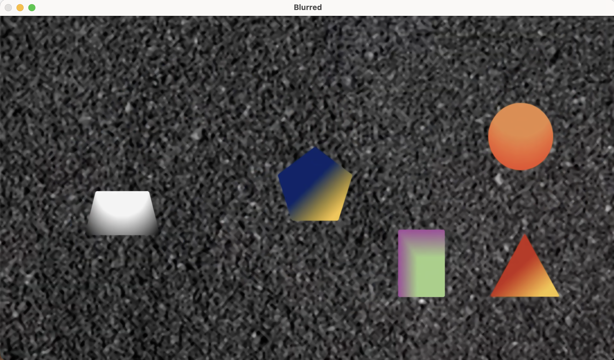
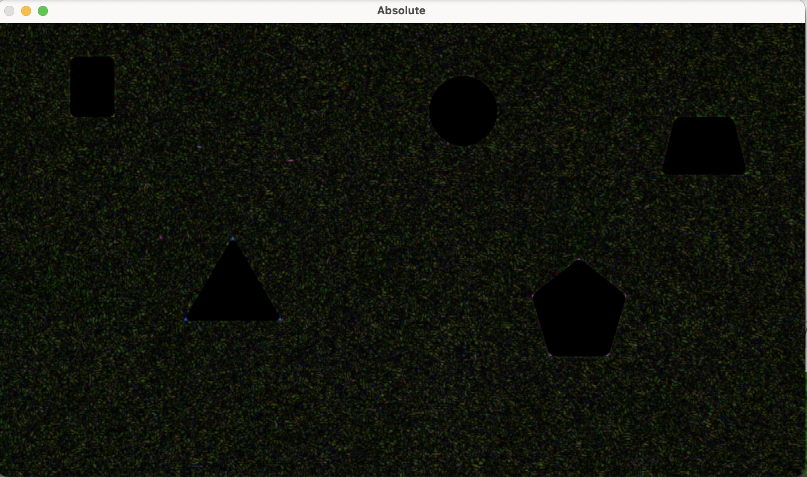
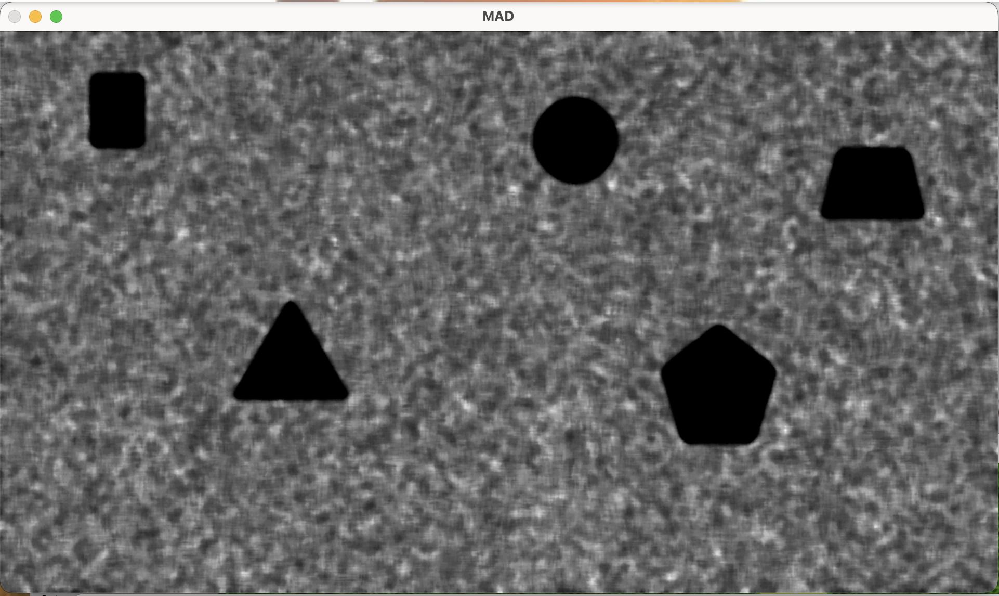
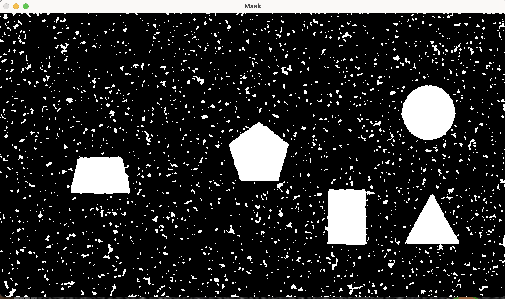
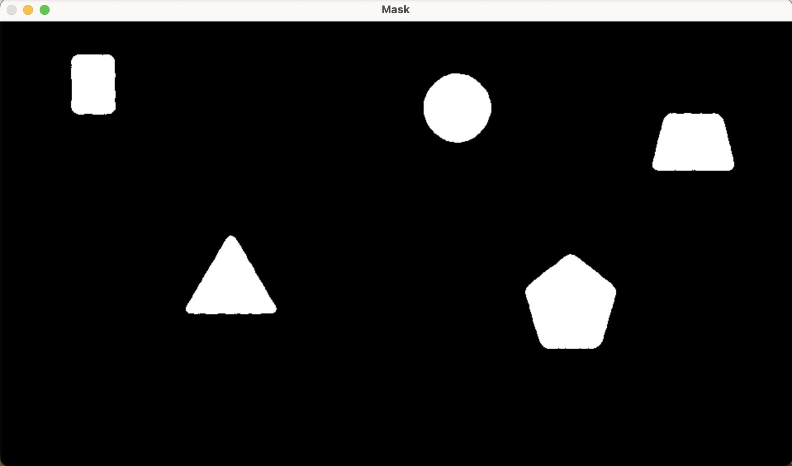
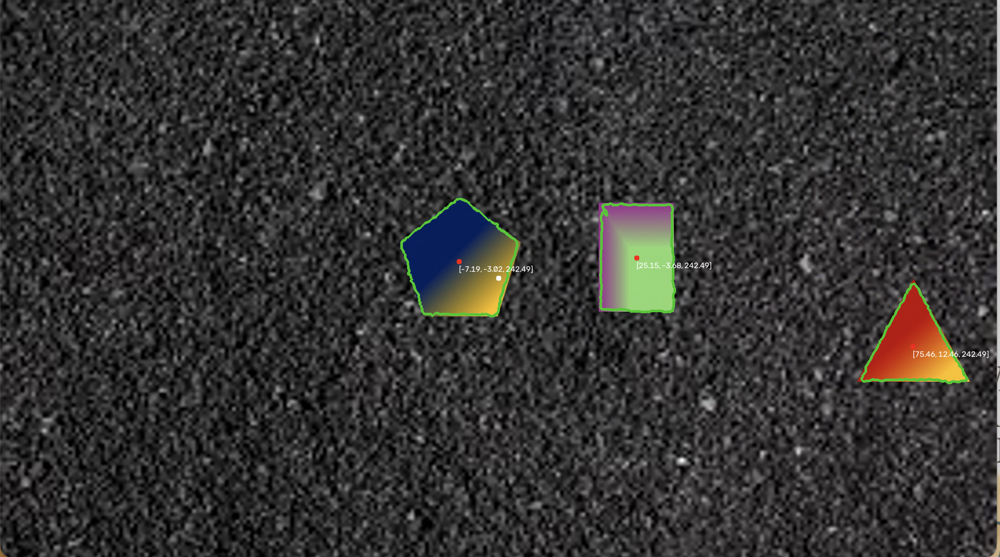

# Main Algorithm

**Stage 1:** Median blur. The first step separates the shapes from the background by denoising the image with a median filter. The reason this helps separate shapes from background: the background is noisy and textured (grass), while each shape has a comparatively uniform, solid color. Median-blurring smooths out that background noise heavily, while barely affecting the already-uniform shape regions.

**Stage 2:** Absolute difference. Next, take the absolute difference between the original image and the blurred version. The result is mostly dark, because in any region that was already uniform, the median blur barely changed the pixel values, so subtracting the two leaves almost nothing. Looking closely, though, and we can still see faint grain in the background where the blur did change things — the noisy grass texture leaves a visible speckled signal in this difference image, while the interior of a shape (say, the pentagon) stays essentially pure black, with no grain at all, because there was nothing for the blur to smooth away there.

This step also fixes the gradient issue. Since the gradient changes linearly, taking the median of linearly increasing region surrounding a central pixel will always give us the pixel itself.

**Stage 3:** Median of the absolute difference (MAD). Now we take the median of that difference image. This step is one of the most essential part of the whole approach. The absolute difference only tells how noisy a certain pixel is however the mad tells us how noisy a a certain region is. Those noisy regions get marked with a bright color while the uniform regions stay unmarked.

**Stage 4:** Extracting outlines and centroids. With that separation in hand, we can threshold the MAD image into a black-and-white mask and trace its boundaries with cv2.findContours. One requirement matters here: a contour has to be a fully closed loop for its enclosed area and centroid to be computed correctly, and this method produces closed loops around each shape. Finding the centroid of each shape is then a matter of using OpenCV's moment functions on each closed contour.

Tracing contours over the mask picks up not just the real shapes but also scattered small contours from residual background noise. The fix is filtering by size. 

**Stage 5** The final stage wrapped the algorithm into a two-node ROS2 system: one node streams video frames out as image messages, and a second node subscribes to that stream, runs the detection pipeline on each incoming frame, and publishes the results as a MarkerArray. 

# Visual Demo

**Demo-1**

https://github.com/user-attachments/assets/9fdcc52c-7d9e-46f0-8fad-39680d702c61

**Demo-2**

https://github.com/user-attachments/assets/050759fa-e64e-45c0-b771-5c7a99d54bf9

# Development Iterations

**Iteration 1 — Naive edge detection.** First try: run a convolution kernel over the image to catch sharp pixel-to-pixel jumps as edges, assuming those mark shape boundaries. Worked fine on a clean, uniform background. Broke immediately on textured grass — the noise threw off just as many "edges" as the real shapes did.

**Iteration 2 — Robust local statistics.** Ditched the global threshold, judged each pixel against its own neighborhood instead. Local MAD (median of |pixel − local median|) measures how much a spot normally varies, robust to outliers. Quiet patch → small MAD → kept. Noisy patch → big MAD → discarded. No need to know shape color or background texture ahead of time.

**Iteration 3 — Hand-rolled sliding window (abandoned).** First version computed a geometric median per window with `scipy.optimize.minimize`, slid by hand across the image. Way too slow. Swapped it for `cv2.medianBlur` — same math, compiled and fast — and moved on.

**Iteration 5 — Ratio + hysteresis** Tried scoring each pixel by how far it is from its local median vs. MAD, but thresholding that alone just gave scattered noise — half of any neighborhood is naturally "above normal." Borrowed hysteresis from Canny instead: keep strong hits automatically, keep weak ones only if connected to a strong one. Gave clean, connected outlines.

**Iteration 6 — Broken rings** Problem: that outline is only one pixel wide, so any tiny gap splits it into disconnected arcs — and a broken arc reads as ~zero area, so the real shape gets thrown out by the noise filter. Morphological closing bridged small gaps, but the circle (weakest contrast) never closed reliably without a kernel big enough to wreck other shapes.

**Iteration 7 — Threshold the interior not the edge** Realized the raw MAD map already shows each shape as one solid low-value blob against noisier background — no ratio score needed. Thresholding that directly gives filled blobs instead of thin outlines, so one bad pixel can't break the whole shape anymore. Cut ~10 pipeline steps down to 5, and it was more robust too.

